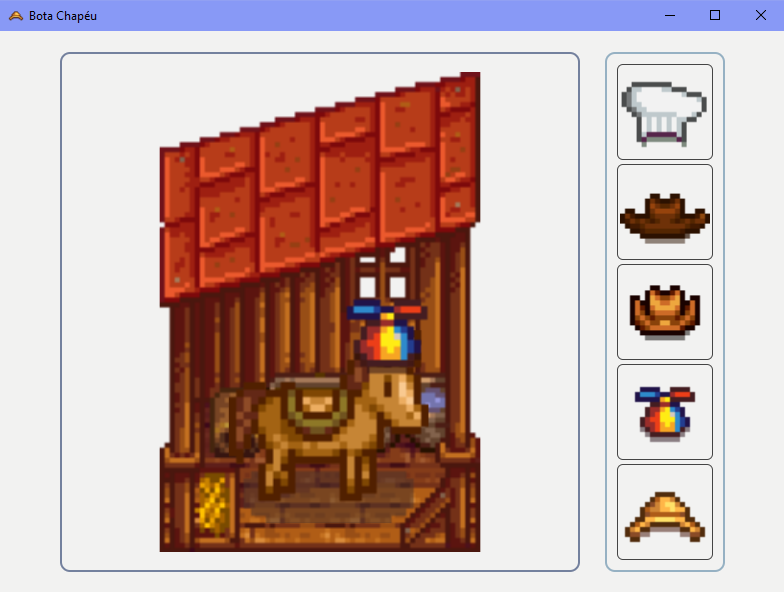

# Bota Chapéu

## Informações importantes 

Esse é um repositório de estudo da minha primeira vez usando o Kotlin Multiplatform para criar um aplicativo desktop (também disponível no web).

Eu ainda estou aprendendo, essa foi a minha primeira tentativa.

Esse repositório já possui o arquivo msi em desktopApp\build\compose\binaries\main\msi é só clicar duas vezes para instalar o projeto final para desktop no seu computador (pelo que eu entendi só funciona para windows, quem usa mac ou linux tem que usar o comando gradle clean package[o equivalente do seu sistema]).

Esse repositório usa imagens que não são de minha autoria (estábulo, cavalo e chapéus são originais do jogo StardewValley) usadas aqui somante para fins de estudo.

Esse repositório não tem interesses comerciais.

## Como usar

Rode pelo IntelliJ( o projeto funciona desktop e web) OU Baixe para desktop pelo msi (caminho no Informações importantes).

Selecione um chapéu para vesti-lo.

Selecione o cavalo para remover o chapéu.

